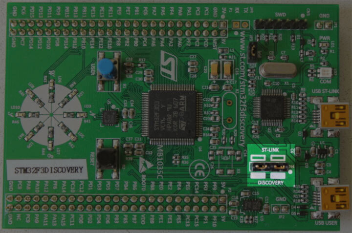

# 安裝驗證

在這個章節中我們將檢查工具和驅動是否已經被正確地安裝和配置了。

使用一個micro USB線纜將你的筆記本/個人電腦連接到discovery開發板上。discovery開發板有兩個USB連接器；使用標記著"USB ST-LINK"的那個，它位於開發板邊緣的中間位置。

也要檢查下ST-LINK的短路帽是否被安裝了。看下面的圖；ST-LINK短路帽用紅色圈起來了。

<p align="center">

</p>

現在運行下面的命令:

``` console
openocd -f interface/stlink.cfg -f target/stm32f3x.cfg
```

> **注意**: 舊版的openocd, 包括從2017發佈的0.10.0, 不包含新的(且更適合的)`interface/stlink.cfg`文件； 你需要使用`interface/stlink-v2.cfg` 或者 `interface/stlink-v2-1.cfg`。
 

你應該看到了下面的輸出，且程序應該阻塞住了控制檯:

``` text
Open On-Chip Debugger 0.10.0
Licensed under GNU GPL v2
For bug reports, read
        http://openocd.org/doc/doxygen/bugs.html
Info : auto-selecting first available session transport "hla_swd". To override use 'transport select <transport>'.
adapter speed: 1000 kHz
adapter_nsrst_delay: 100
Info : The selected transport took over low-level target control. The results might differ compared to plain JTAG/SWD
none separate
Info : Unable to match requested speed 1000 kHz, using 950 kHz
Info : Unable to match requested speed 1000 kHz, using 950 kHz
Info : clock speed 950 kHz
Info : STLINK v2 JTAG v27 API v2 SWIM v15 VID 0x0483 PID 0x374B
Info : using stlink api v2
Info : Target voltage: 2.919881
Info : stm32f3x.cpu: hardware has 6 breakpoints, 4 watchpoints
```

內容可能並不是一模一樣，但是在最後一行，你應該看到了breakpoints和watchpoints，如果你看到了，那就終止OpenOCD進程然後進入[下個章節]

[下個章節]: ../../start/index.md

如果你沒看到"breakpoints"這行，嘗試下下列命令中的某一個命令。

``` console
openocd -f interface/stlink-v2.cfg -f target/stm32f3x.cfg
```

``` console
openocd -f interface/stlink-v2-1.cfg -f target/stm32f3x.cfg
```

如果這些命令的某條起作用了，那意味著你使用的discovery開發板是一箇舊的版本。那也不成問題，但是你要記住這件事，因為隨後你的配置可能有點不同。你可以移到[下個章節]了。

如果這些命令在普通用戶模式下都沒用，嘗試下使用root模式運行它們(e.g. `sudo openocd ..`)。如果命令在root模式下起作用，需要檢查下[udev rules]是否被正確地設置了。

[udev rules]: linux.md#udev-rules

如果這些都試了，OpenOCD還不工作，請打開一個[issue]，我們將幫助你！

[issue]: https://github.com/rust-embedded/book/issues
